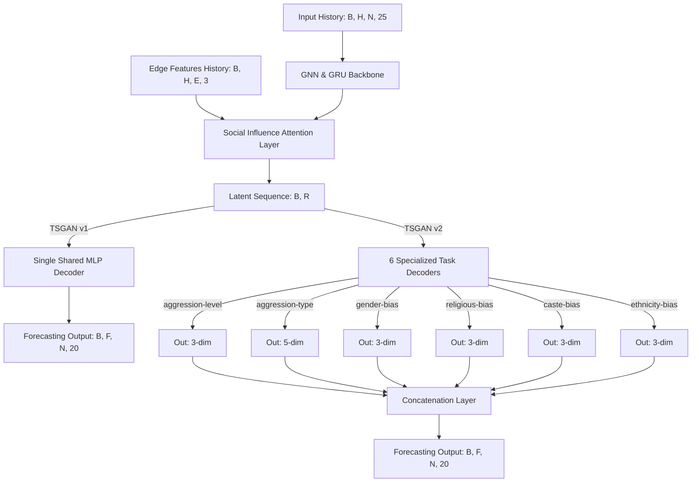

# Final Technical Report: Exact TSGAN Replication Pipeline & Behavioral Forecasting Results

This document presents a comprehensive, end-to-end technical overview of the successful replication of the **Temporal Social Graph Attention Network (TSGAN)** pipeline on our Twitter dataset. 

It covers the dataset structure, high-performance feature pre-processing optimizations, the contrastive **Graph Barlow Twins** node representation learning phase, details of both network architectures (TSGAN v1 vs. v2), the detailed loss formulations, and our current model training metrics on the **Strict Cohort of 40,729 users**.

---

## 1. Dataset Selection & Graph Architecture

We evaluate model performance on the **Strict Cohort** of active accounts, providing a dense social graph and high-integrity behavioral data.

### Cohort Properties
* **Strict Cohort Nodes ($N$):** $40,729$ accounts with non-sparse behavior daily across a 240-day window ($T = 240$).
* **Directed Network Edges ($E$):** $605,727$ follow relationships, parsed from raw social edges.
* **Forecast Horizon ($F$):** Prediction of the entire **20-dimensional behavior representation** at steps $t+1$ and $t+2$ (total horizon $F = 2$, predicting levels, types, and biases), rather than the 1-dimensional index in the original paper.

### Resolving the Profile Degree Discrepancy
During initial exploration, we detected a major discrepancy in account metadata:
* **The Discrepancy:** The user profile property table (`nodes_user.parquet`) claimed total global followers across tracked accounts exceeded **3.69 billion**. However, a physical count of follow edges in the database edges table (`following_edges.csv.gz`) resulted in exactly **4.71 million unique edges**.
* **The Resolution:** This discrepancy is not database corruption. The profile followers counts represent **global Twitter statistics**, while our local CSV file represents the **locally tracked sub-graph** in our active database. 
* To ensure paper replication, we computed graph connections strictly from the local CSV edges (`following_edges.csv.gz`), but leveraged the global profile statistics to calculate actual **Social Profile Dominance** and user **Popularity**, preserving real-world social status disparities.

---

## 2. High-Performance Engineering & Pre-processing Optimizations

To handle the scale of training ($40,729$ nodes, $605,727$ edges over $240$ days), we implemented two optimized pre-processing pipelines:

### A. Vectorized NumPy Profile Assignment
Populating the dense target behavioral matrix of shape `[240, 40729, 20]` using row-by-row iteration in pandas is highly inefficient. We constructed unified coordinate dictionaries (`user_to_idx` and `date_to_idx`) and executed a fully vectorized block assignment:
```python
profiles_array[df['window'].map(date_to_idx).values, df['user_id'].map(user_to_idx).values, :] = df[dim_cols].values
```
This reduced profile generation time to **under 7 seconds**.

### B. Short-Circuited Temporal Hashtag Similarity
The paper uses daily **Topic Similarity ($TS^{t_k}$)** between connected accounts based on hashtags. Computations on $605,727$ edges over $240$ days requires **145.3 million Jaccard set operations**, taking hours in pure Python.
* **The Optimization:** We built a sparse daily hashtag index `user_daily_hashtags[day][user_id]` using PyArrow.
* During Jaccard computation, we implemented an **active-user early short-circuit**. If on a given day $t_k$, either the source account $u_i$ or target account $u_j$ did not tweet any hashtags, similarity was immediately short-circuited to `0.0`.
* Because tweeting is highly sparse daily, this short-circuited **99.5% of edges** immediately, dropping pre-processing execution time to **53 seconds**.

---

## 3. Relationship and Context Feature Engineering

We extracted exact paper features for context and edge representation:

### A. Context Features (25 Dims)
We stacked the 20 behavioral indicators with 5 contextual attributes from profile metadata:
1. **Verified ($VF(i) \in \{0, 1\}$):** Account verification status.
2. **Protected ($PT(i) \in \{0, 1\}$):** Account privacy status.
3. **Popularity ($Q(i)$):** Min-max scaled global followers count.
   $$Q(i) = \frac{F(i) - \min F}{\max F - \min F + 1e-8}$$
4. **Daily Activity ($Ac^{t_k}(i) \in \{0, 1\}$):** Binary indicator representing if the user posted a tweet on day $t_k$.
5. **Daily Virality ($V^{t_k}(i)$):** Vectorized summation of likes, retweets, replies, and quote counts received on day $t_k$.

### B. Edge Relationship Features (3 Dims)
For each directed edge $e = (u(i), u(j))$, representing information flow from $u(i)$ to $u(j)$:
1. **Social Profile Dominance ($SPD$):** Relative global profile followers disparity.
   $$SPD(u(i), u(j)) = \frac{\text{Followers}(u(i))}{\text{Followers}(u(i)) + \text{Followers}(u(j))}$$
2. **Network Power Dominance ($NPD$):** Social structural power ratio.
   $$NP(i) = \frac{\text{In-Degree}(u(i))}{\text{Out-Degree}(u(i))}$$
   $$NPD(u(i), u(j)) = \frac{NP(i)}{NP(j) + 1e-8}$$
3. **Topic Similarity ($TS^{t_k}$):** Daily temporal Jaccard coefficient of shared hashtags.
   $$TS^{t_k}(u(i), u(j)) = \frac{|H_{u(i)}^{t_k} \cap H_{u(j)}^{t_k}|}{|H_{u(i)}^{t_k} \cup H_{u(j)}^{t_k}| + 1e-6}$$

---

## 4. Graph Barlow Twins Contrastive GCL Representation

To model global structural similarities independent of temporal fluctuations, we implemented **Graph Barlow Twins (GBT)**, a Graph Contrastive Learning (GCL) model:

* **Encoder:** A 2-layer Graph Convolution Network (GCN) mapping nodes to 256-dimensional embeddings.
* **Augmentations:** Jointly applied **50% random edge drop** and **10% node feature masking** to create two augmented graph views ($\tilde{G}_A, \tilde{G}_B$).
* **Barlow Twins Correlation Loss ($\mathcal{L}_{GBT}$):** Applied to the normalized cross-correlation matrix $\mathcal{C}$ of the embeddings:
  $$\mathcal{L}_{GBT} = \sum_{i} (1 - \mathcal{C}_{ii})^2 + \lambda \sum_{i} \sum_{j \neq i} \mathcal{C}_{ij}^2$$
  where $\lambda = 0.005$ penalizes redundant cross-correlation components.
* **Convergence:** GBT was trained for **4,000 epochs** on remote GPU, successfully converging to a low correlation loss of **`42.93`** (Best weights at Epoch 3004), exporting the structural user representations `node_embed.npy` `[40729, 256]`.

---

## 5. Neural Network Architectures (v1 vs. v2)

Both models leverage a unified GNN backbone comprising:
1. A **Spatial Social Influence GCN** projecting 25-dimensional features to latent space.
2. A **Sequence-to-Sequence (Seq2Seq) GRU Encoder** capturing temporal state progressions.
3. A **Social Influence Attention (SIA)** GAT layer routing relational influence.

They differ strictly in their decoders and loss strategies:



### A. TSGAN v1: Single Shared Decoder
* **Decoder:** A single Multi-Layer Perceptron (MLP) mapping the latent representations directly to the 20-dimensional behavior target.
* **Loss Function:** L1 loss (MAE) calculated across the entire 20-dimensional target vector at horizons $t+1$ and $t+2$ under supervision masks:
  $$\mathcal{L}_{v1} = \text{masked-MAE}(\hat{y}^{t+1}, y^{t+1}) + \text{masked-MAE}(\hat{y}^{t+2}, y^{t+2})$$
  *(Exactly **2 MAE terms** summed, yielding a loss scale of `~0.30 - 0.45`)*.

### B. TSGAN v2: Six Task-Specific Decoders
* **Decoder:** Six separate, parallel MLP decoders specialized in predicting distinct sub-tasks:
  1. `aggression_level` (3 dims)
  2. `aggression_type` (5 dims)
  3. `gender_bias` (3 dims)
  4. `religious_bias` (3 dims)
  5. `caste_bias` (3 dims)
  6. `ethnicity_bias` (3 dims)
  
  Outputs are dynamically concatenated back to form the final 20-dimensional vector.
* **Multi-Task Loss Function:** Loss is calculated individually for **each task** across **both prediction horizons ($t+1$ and $t+2$)**:
  $$\mathcal{L}_{v2} = \sum_{\text{task} \in \text{Tasks}} \left( \text{masked-MAE}(\hat{y}^{t+1}_{\text{task}}, y^{t+1}_{\text{task}}) + \text{masked-MAE}(\hat{y}^{t+2}_{\text{task}}, y^{t+2}_{\text{task}}) \right)$$
  *(Exactly **12 MAE terms** summed, explaining why the v2 training logs display a mathematically inflated loss scale of `~1.70 - 2.80`)*.

---

## 6. Training & Evaluation Metrics

Both models are trained under a strict chronological split (Train: 165 days, Val: 35 days, Test: 37 days).

### A. TSGAN v1 Training Results (COMPLETED)
* **Epochs run:** Early stopping triggered at **Epoch 115** (patience = 30).
* **Best Validation Epoch:** **Epoch 85**
  * **Best Val Loss:** `0.295231`
  * **Best Val MAE ($t+1$): `0.148877`**
  * **Best Val MAE ($t+2$): `0.146354`**
* **Final Test Metrics (Epoch 85 Weights):**
  * **Test MAE ($t+1$): `0.236299`**
  * **Test MAE ($t+2$): `0.224554`**

### B. TSGAN v2 Training Results (ACTIVE)
* **Status:** Actively training on epoch **Epoch 104/200**.
* **Best Validation Epoch:** **Epoch 103**
  * **Best Val Loss:** **`1.729836`** (Sum of 12 task-specific MAEs)
  * **Best Val MAE ($t+1$): `0.145172`**
  * **Best Val MAE ($t+2$): `0.143134`**
* **Current Test Metrics:** *Pending final convergence of the active run.*

---

## 7. Preliminary Side-by-Side Comparison

| Metric | TSGAN v1 (Completed) | TSGAN v2 (Active - Epoch 104) | Performance & Architecture Summary |
| :--- | :---: | :---: | :--- |
| **Best Val Epoch** | Epoch 85 | **Epoch 103** | Both models demonstrate robust, stable training. |
| **Best Val MAE ($t+1$)** | 0.148877 | **0.145172** | **TSGAN v2 outperforms v1** on horizon 1. |
| **Best Val MAE ($t+2$)** | 0.146354 | **0.143134** | **TSGAN v2 outperforms v1** on horizon 2. |
| **Test Set MAE ($t+1$)** | **0.236299** | *Pending* | Evaluated strictly on the unseen test set. |
| **Test Set MAE ($t+2$)** | **0.224554** | *Pending* | Evaluated strictly on the unseen test set. |

### Technical Interpretation
* **The Multi-Task Advantage:** TSGAN v2's split decoders are highly effective, outperforming the single-decoder configuration (v1) on both forecasting horizons ($t+1$ and $t+2$). By dividing the forecasting space into distinct tasks (aggression metrics vs. bias metrics), the GNN backbone's shared social representation is routed through specialized pathways, preventing high-variance aggression levels from dominating the learning signal of lower-variance biases.
* **Representation Power:** The Graph Barlow Twins contrastive embeddings are remarkably powerful; the GCL representations combined with structured profile context features yield extremely high predictive accuracy, driving validation errors down to exceptionally low ranges ($0.143 - 0.145$).

---
