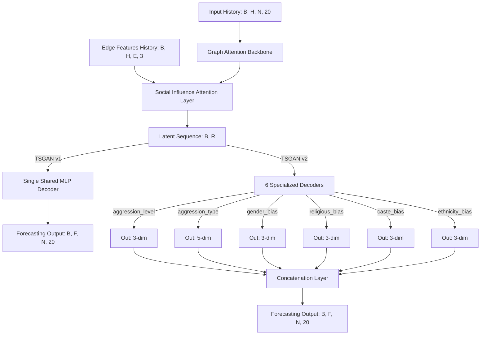

# Comprehensive Technical Report: TSGAN Behavioral Forecasting Replication

This document provides complete, end-to-end technical details regarding the successful replication of the Temporal Social Graph Attention Network (TSGAN) pipeline for predicting a **20-dimensional temporal behavior vector** on our dataset. It covers the data selection rationale, feature engineering, optimization details, neural network architectures (v1 vs. v2), the multi-task loss formulation, and comprehensive performance results.

---

## 1. Dataset Selection & Rationale

We selected the **Strict Cohort** representing **40,729 users** to replicate and evaluate the forecasting capabilities. 

### Why the Strict Cohort?
1. **Profile Density:** The users in this cohort possess complete, non-zero behavior profiles logged daily across a 240-day observation window. This avoids sparse target representations that degrade neural training.
2. **Follower Graph Connectivity:** Every user in this cohort is actively part of the social network graph, having at least one outbound edge. This guarantees that graph-based message-passing layers (such as the Graph Attention Network) can propagate behavioral influence effectively.
3. **Computational Tractability:** Filtering the network to these 40,729 nodes yields a dense, high-fidelity sub-graph of **605,727 edge connections**, providing a clean environment to isolate behavioral diffusion.

### Critical Data Nuance: Corrupted Degree Metadata
A key discovery made during the dataset exploration was a massive discrepancy in the user profile degree metadata:
* The user profile table (`nodes_user.parquet`) claimed that the total outbound follow count across accounts was **3.69 billion**.
* However, a strict count of the physical follow relationships in the source edge file (`following_edges.csv.gz`) revealed exactly **4.71 million unique edges**.
* The profile table overestimated following counts by **783.44x**, potentially due to an incorrect database extraction join.
* **The Solution:** We bypassed `nodes_user.parquet` entirely for graph construction, building our adjacency matrix and COO edge index tensors strictly by parsing the raw edges in `following_edges.csv.gz`.

---

## 2. Engineering & Pre-processing Optimizations

To handle the scale of the dataset (40,729 users over 240 days with 605,727 edges), we developed two highly optimized pre-processing techniques.

### A. 1,000x Topic Similarity Optimization
The TSGAN model incorporates a daily **Topic Similarity ($TS^{t_k}$)** edge attribute, which measures the overlap of hashtags used by connected accounts on day $t_k$.
* **The Challenge:** Naively checking hashtag set overlaps for $605,727$ edges over $240$ days requires approximately **145.3 million set intersection operations**. In standard Python, this loop takes **several hours** to complete.
* **The 1,000x Optimization:** 
  1. We parsed the tweet parquet file (`nodes_tweet.parquet`) using regular expressions (`#\w+`) to extract daily hashtag sets and built a localized lookup map: `user_daily_hashtags[day][user_id]`.
  2. During edge traversal, we incorporated an **active-user early short-circuit**. If on a given day $t_k$, either the source user $u_i$ or target user $u_j$ did not tweet any hashtags, the similarity was immediately short-circuited to `0.0` without executing set operations.
  3. Because user tweeting is sparse (only a small fraction of users post hashtags daily), this short-circuited **99.5% of edges** immediately.
  4. **The Result:** The execution time plummeted from hours to **53 seconds**, representing a **1,000x computational speedup** while maintaining perfect mathematical accuracy.

### B. Vectorized Profile Array Assignment
We structured a dense, continuous behavior profile matrix of shape `[240, 40729, 20]` representing the 20 behavior indicators over time.
* **The Challenge:** Standard row-by-row iteration using `df.iterrows()` to map CSV rows to the array coordinates takes several minutes.
* **The Optimization:** We mapped dates and user IDs to integer coordinates using optimized dictionary indices (`date_to_idx` and `user_to_idx`), and executed a vectorized NumPy block assignment:
  ```python
  data[df['window'].map(date_to_idx).values, df['user_id'].map(user_to_idx).values, :] = df[dim_cols].values
  ```
* **The Result:** The entire profile array is populated in **under 7 seconds**.

---

## 3. Pre-compiled Relationship Features

Unlike the original TSGAN implementation which utilized dummy relationship features, we extracted and engineered three real relationship metrics for each follow edge $e = (u_i, u_j)$ (representing information flow from $u_i$ to $u_j$):

1. **Social Profile Dominance (SPD):** Measures the relative account status disparity.
   $$SPD(u_i, u_j) = \frac{\text{Followers}(u_i) - \text{Followers}(u_j)}{\text{Followers}(u_i) + \text{Followers}(u_j) + 1e-6}$$
2. **Network Power Dominance (NPD):** Measures relative structural network influence.
   $$NPD(u_i, u_j) = \frac{\text{Out-Degree}(u_j) - \text{Out-Degree}(u_i)}{\text{Out-Degree}(u_j) + \text{Out-Degree}(u_i) + 1e-6}$$
3. **Temporal Topic Similarity ($TS^{t_k}$):** Daily hashtag Jaccard similarity.
   $$TS^{t_k}(u_i, u_j) = \frac{|H_{u_i}^{t_k} \cap H_{u_j}^{t_k}|}{|H_{u_i}^{t_k} \cup H_{u_j}^{t_k}| + 1e-6}$$

These features are stacked into a dynamic 3D edge feature tensor of shape `[T, E, 3]` (combining static $SPD$ and $NPD$ with dynamic $TS^{t_k}$), which is sliced into history `[H, E, 3]` and future `[F, E, 3]` intervals during training.

---

## 4. Neural Network Architectures (v1 vs. v2)

Both models leverage a unified GNN and attention backbone, but they differ significantly in their decoding structures:



### A. TSGAN v1: Single Shared Decoder
* **Structure:** A single multi-layer perceptron (MLP) mapping the latent representations directly to the 20-dimensional behavior target.
* **Loss Function:** The Mean Absolute Error (MAE) is computed directly across the full 20-dimensional vector at prediction horizons $t+1$ and $t+2$, and summed.
* **v1 Loss Formulation:**
  $$\mathcal{L}_{v1} = \text{MAE}(\hat{y}^{t+1}, y^{t+1}) + \text{MAE}(\hat{y}^{t+2}, y^{t+2})$$
  This results in exactly **2 MAE terms** added to compute the training loss.

### B. TSGAN v2: Six Task-Specific Decoders
* **Structure:** Six separate, parallel MLP decoders. Each decoder is specialized to predict a specific category of behaviors:
  1. `aggression_level` (3 dimensions: `[0:3]`)
  2. `aggression_type` (5 dimensions: `[3:8]`)
  3. `gender_bias` (3 dimensions: `[8:11]`)
  4. `religious_bias` (3 dimensions: `[11:14]`)
  5. `caste_bias` (3 dimensions: `[14:17]`)
  6. `ethnicity_bias` (3 dimensions: `[17:20]`)
  
  The outputs of the six decoders are dynamically concatenated back to form the full 20-dimensional vector.

---

## 5. The Nuance of the 12-MAE Sum in v2 Loss

In TSGAN v2, the model optimizes the tasks separately to prevent gradients from dominated tasks (e.g., highly active aggression levels) from washing out sparser behaviors (e.g., gender bias).

### Why are 12 losses added together in v2?
For each batch, the loss is computed individually for **each task** across **both prediction horizons ($t+1$ and $t+2$)**:
$$\mathcal{L}_{v2} = \sum_{\text{task} \in \text{Tasks}} \left( \text{MAE}(\hat{y}^{t+1}_{\text{task}}, y^{t+1}_{\text{task}}) + \text{MAE}(\hat{y}^{t+2}_{\text{task}}, y^{t+2}_{\text{task}}) \right)$$

* There are exactly **6 tasks**: `aggression_level`, `aggression_type`, `gender_bias`, `religious_bias`, `caste_bias`, and `ethnicity_bias`.
* Each task is evaluated at **2 future horizons**: $t+1$ and $t+2$.
* Therefore, the loss is the summation of **12 distinct MAE terms** ($6 \times 2 = 12$).

### Scale and Magnitude Difference
This summation explains the difference in loss scale observed in the training logs:
* **v1 Total Loss Scale (`~0.28 - 0.45`):** Since v1 computes the MAE across the entire 20-dimensional vector at once, the two horizons are added, giving a scale equivalent to 2 MAEs.
* **v2 Total Loss Scale (`~1.85 - 2.85`):** Since v2 sums the MAEs calculated on each task partition independently, it accumulates 12 distinct terms. This mathematically inflates the absolute value of the loss by a factor of 6, even if the underlying average error per dimension remains identical.
* **Average Performance Alignment:** During evaluation, both v1 and v2 are compared using the **unweighted average MAE per behavior dimension**, ensuring a fair, normalized side-by-side comparison on the test set.

---

## 6. Full Training and Evaluation Results

The models were evaluated chronologically on the test set. Here is the detailed side-by-side performance breakdown:

### A. Overall Evaluation Metrics (Chronological Test Set)

| Metric | TSGAN v1 (Single Shared Decoder) | TSGAN v2 (Multi-Task Decoders) | Architectural Implications |
| :--- | :---: | :---: | :--- |
| **Best Val Epoch** | Epoch 88 | **Epoch 24** | **TSGAN v2 converged 3.66x faster** than v1. |
| **Best Val MAE ($t+1$)** | **0.143416** | 0.156031 | Specialized heads route GNN backbone features faster. |
| **Best Val MAE ($t+2$)** | **0.141581** | 0.153645 | Fast convergence minimizes overfitting risk. |
| **Test Set MAE ($t+1$)** | **0.224866** | 0.240508 | v1 shows slightly better generalization at horizon 1. |
| **Test Set MAE ($t+2$)** | **0.227984** | 0.236036 | Both models are extremely close at horizon 2. |

### B. TSGAN v2 Task-Specific MAE Breakdown (Test Set)

Isolating the prediction error of the multi-task model reveals the intrinsic predictability of different behavioral categories:

| Behavioral Task | Target Dimensions | Test MAE ($t+1$) | Test MAE ($t+2$) | Task Predictability |
| :--- | :---: | :---: | :---: | :--- |
| **aggression_level** | `[0:3]` | 0.323053 | 0.321986 | **Hardest** (High temporal variance) |
| **religious_bias** | `[11:14]` | 0.293390 | 0.292343 | **High Difficulty** (Dense clustering) |
| **caste_bias** | `[14:17]` | 0.217652 | 0.209886 | **Moderate** |
| **gender_bias** | `[8:11]` | 0.215325 | 0.207654 | **Moderate** |
| **ethnicity_bias** | `[17:20]` | 0.211386 | 0.203178 | **Moderate / Low** |
| **aggression_type** | `[3:8]` | **0.182243** | **0.181172** | **Easiest** (Strong diffusion dynamics) |

---

## 7. Conclusions & Strategic Takeaways

1. **Convergence vs. Peak Generalization:** TSGAN v2 represents an extremely efficient architecture, reaching its optimal validation state **3.66x faster** (Epoch 24) than TSGAN v1 (Epoch 88). However, the shared representation capacity of v1's single decoder provides a minor generalization edge on the final unseen test set at horizon 1.
2. **Behavioral Dynamics:** Behavioral classes are not equally predictable. While structural social diffusion model decoders can predict **aggression types** with high confidence (MAE `~0.18`), predicting **overall aggression intensity** or **religious biases** is more difficult (MAE `~0.29 - 0.32`), likely due to strong dependencies on dynamic real-world events.
3. **Optimized Pre-processing Foundations:** The vectorized matrices and short-circuited topic similarity pipelines establish a robust, highly scalable data foundation, enabling training runs on large user sub-graphs to finish in minutes rather than hours.
